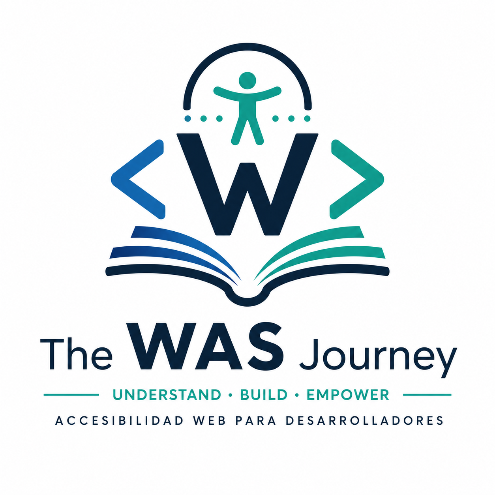

# The WAS Journey

<p align="center">
  
</p>

<h1 align="center">The WAS Journey</h1>

<p align="center">
Building deep understanding of Web Accessibility to become a better Frontend Engineer and confidently pass the IAAP WAS certification.</p>


> **Una guía abierta para comprender la accesibilidad web desde los fundamentos de la plataforma.**

> *"Las respuestas se olvidan. Los modelos mentales permanecen."*


---

## ¿Qué es The WAS Journey?

**The WAS Journey** es un proyecto abierto de investigación y aprendizaje sobre accesibilidad web.

Su objetivo es construir un handbook técnico, basado en evidencias, que ayude a comprender cómo funciona realmente la accesibilidad web y a desarrollar el criterio necesario para tomar mejores decisiones como desarrollador Frontend.

Aunque nace como preparación para la certificación **IAAP Web Accessibility Specialist (WAS)**, el proyecto está pensado para seguir siendo útil mucho después de obtener la certificación.

No es un resumen de las WCAG.

No es una recopilación de apuntes.

No es un curso.

Es una forma de estudiar la accesibilidad entendiendo el porqué de las cosas.

---

## Nuestra filosofía

La accesibilidad no debería aprenderse memorizando criterios.

Debería comprenderse estudiando:

- cómo funciona la plataforma web;
- qué papel desempeñan HTML y ARIA;
- cómo construyen los navegadores el árbol de accesibilidad;
- cómo interactúan las tecnologías de asistencia;
- qué dicen realmente las especificaciones.

Creemos que comprender estos fundamentos permite tomar mejores decisiones técnicas que limitarse a recordar una lista de reglas.

---

## ¿A quién va dirigido?

Este proyecto está pensado principalmente para:

- Desarrolladores Frontend.
- Ingenieros de Software.
- UX Engineers.
- Especialistas en Accesibilidad.
- Personas que preparan la certificación IAAP WAS.

Se recomienda tener conocimientos básicos de HTML, CSS y JavaScript.

---

## ¿Qué encontrarás aquí?

El contenido se organiza siguiendo un orden conceptual.

Antes de estudiar WCAG o WAI-ARIA, comprenderemos cómo funciona la plataforma web.

Entre otros temas, el proyecto cubrirá:

- Conceptos fundamentales.
- HTML semántico.
- Accessibility Tree.
- APIs de accesibilidad.
- Navegadores.
- Tecnologías de asistencia.
- WAI-ARIA.
- WCAG.
- Formularios.
- Componentes complejos.
- React.
- Design Systems.
- Testing.
- Automatización.
- Casos reales.
- Preparación para la certificación WAS.

---

## Cómo está organizado el aprendizaje

Cada tema sigue siempre el mismo proceso:

1. Introducción del concepto.
2. Planteamiento de una pregunta.
3. Hipótesis.
4. Razonamiento.
5. Contraste con las especificaciones.
6. Conclusiones.
7. Documentación.

El objetivo es construir conocimiento paso a paso, sin avanzar hasta comprender el concepto anterior.

---

## Estructura del repositorio

```text
.
├── README.md
├── LICENSE
├── CONTRIBUTING.md
├── CHANGELOG.md
├── .gitignore
├── assets/
│   ├── logo.svg
└── docs/
    ├── 00-manifiesto.md
    ├── 01-conceptos-fundamentales.md
    ├── 02-laboratorio.md
    ├── 03-banco-de-preguntas.md
    └── 04-lecciones-aprendidas.md
```

---

## Estado del contenido

Cada documento indicará su nivel de madurez.

| Estado | Descripción |
| ------- | ----------- |
| 🟡 Borrador | Contenido en desarrollo. |
| 🟠 Revisando | En proceso de validación y contraste con las fuentes. |
| 🟢 Estable | Contenido revisado y considerado técnicamente sólido. |

Este repositorio es un documento vivo.

La mejora continua forma parte del proyecto.

---

## Antes de empezar

Te recomendamos comenzar por:

📖 **docs/00-manifiesto.md**

En él se describen la filosofía, la metodología y los principios que guían todo el proyecto.

Las recomendaciones del handbook no se incorporan hasta haber sido contrastadas con la especificación, fuentes de referencia y validación práctica.


---

## Roadmap

### Fase 1 · Fundamentos

- [x] Estructura del proyecto.
- [ ] Conceptos fundamentales.
- [ ] HTML semántico.
- [ ] Accessibility Tree.

### Fase 2 · Accesibilidad Web

- [ ] WAI-ARIA.
- [ ] WCAG.
- [ ] Formularios.
- [ ] Navegación.

### Fase 3 · Frontend

- [ ] React.
- [ ] Design Systems.
- [ ] Testing.
- [ ] Automatización con IA.

### Fase 4 · Certificación WAS

- [ ] Banco de preguntas.
- [ ] Simulacros.
- [ ] Casos prácticos.

---

## Nuestro compromiso

Cada afirmación técnica incluida en este repositorio debe poder justificarse mediante fuentes fiables.

Siempre que sea posible diferenciaremos entre:

- 📜 Especificaciones oficiales.
- 🎓 Conocimiento específico para la certificación WAS.
- 💡 Buenas prácticas.
- 💼 Experiencia profesional.
- 👥 Opiniones fundamentadas.

Si detectamos un error, lo corregiremos.

Si una especificación cambia, el contenido evolucionará con ella.

---

## Sobre este proyecto

Este repositorio está siendo desarrollado de forma iterativa.

El contenido se investiga, debate, contrasta y revisa continuamente antes de considerarse estable.

Si detectas un error, una explicación mejor o una referencia más precisa, cualquier aportación será bienvenida.

---

## Licencia

Copyright © 2026 Jorge López.

El contenido de este repositorio se distribuye bajo la licencia **Creative Commons Attribution-ShareAlike 4.0 International (CC BY-SA 4.0)**.

Puedes compartir, adaptar y reutilizar el contenido, siempre que:

- se reconozca la autoría original;
- se indique si se han realizado modificaciones;
- las obras derivadas se distribuyan bajo la misma licencia.

---

## Agradecimientos

Gracias por dedicar tiempo a aprender accesibilidad.

Si este proyecto consigue ayudar a otros desarrolladores a comprender mejor la plataforma web y a crear interfaces más accesibles, habrá cumplido su propósito.

Porque una certificación se obtiene una vez.

Pero una buena forma de razonar acompaña durante toda la carrera profesional.

Started on July 13, 2026. Built in public.